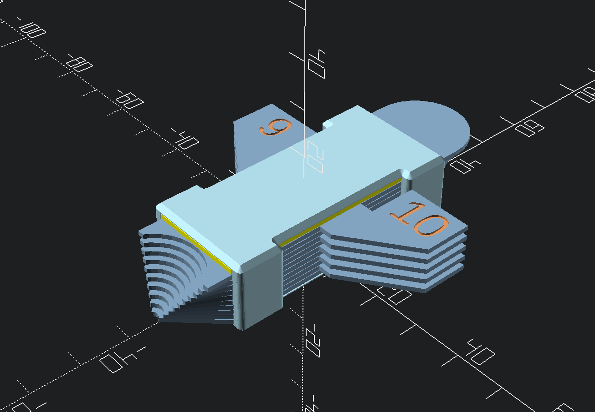

# Parametric Captured Radius Gauge Set

A parametric (OpenSCAD) radius gauge set that uses captured gauge leaves and a novel 'decoupling' layer.




## Prerequisites  

This relies on the [BOSL2](https://github.com/BelfrySCAD/BOSL2) library.
Inside the repo directory, install BOSL2 by running: 

```
git clone https://github.com/BelfrySCAD/BOSL2
```

Then open `gauge.scad` in OpenSCAD.

## Parametric Customization

The script is fully parametric and all variables that effect the model are notated/commented to be useable with the OpenSCAD Customizer (or by just modifying the script).

## Printing

This model uses nothing but 3D printed parts (and **no glue nor screws**) but requires an unusual printing method. 

### Slicing
For the defaults, in your slicer use 0.2mm layer height and 0.4mm line width (it will likely complain that the case won't print, but we know better). Print everything in the same filament type, PLA is fine.

I dial down the flow on the gauge leaf and decoupler (98% or so). This will ensure the top layer is very smooth. You can also re-orient the top printing direction to be parallel to the end-product sliding.

### Print step-by-step

1. Print the gauge leaves.
2. Print the decoupler. You can print the leaves and the decoupler together or separately from the leaves. 
3. Print the case and pause at the layer (via slicer or printer interface) before the top begins. You must print these separately from the leaves and decoupler.
4. While the case is still on the bed, layer in each gauge leaf and put the decoupler on top. This should be slightly lower than the case print. Assuming defaults, it should be a single layer.
5. Resume the case print. This will print over top of the decoupler and the sagging layers of the case will fuse to the decoupler.
6. Remove it from your printer.

## License 

This project is licensed under the [Solderpad Hardware License v2.1](http://solderpad.org/licenses/SHL-2.1/) which is a wraparound license to the Apache License Version 2.0. 